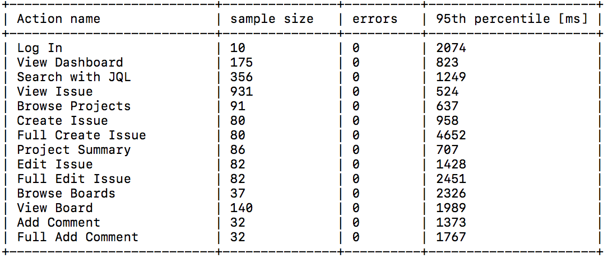

# Benchmark your Jira instance

[JPT](../../README.md) helps you evaluate how well Jira can handle a data set under specific conditions. 
This is useful for testing how hardware or configuration changes can affect the performance of your Jira instance. 

JPT tests performance from a user’s perspective by focusing on an instance’s _response time_ to common user actions. 
Atlassian uses JPT to benchmark the performance of each Jira release, posting the results on [Scaling Jira](https://confluence.atlassian.com/enterprise/scaling-jira-867028644.html).

## How it works

JPT benchmarks a Jira instance’s performance _remotely_, running the most common user actions multiple times.
When JPT finishes testing, it reports:

1. What **user actions** it performed
2. **How many times** it performed each action
3. How many times each action resulted in an **error**
4. The **95th percentile** of all response times for each action

At present, JPT supports benchmarking for Jira Software.

### Data changes to tested instance

Keep in mind that these actions will affect the instance’s data set, as Jira will treat JPT traffic just like normal user traffic. 
These changes include:

 1. Globally disabling the Rich Text Editor
 2. Changes to the browse history of the test user (recent issues, recent boards, and so on)
 3. Changes to the data displayed on the Activity Stream
 4. Added test issues (with default settings, around 80 issues or 4 issues/min)
 5. Added test comments (with default settings, around 30 comments or 2 comments/min)
 6. Added cache data and resources for visited pages

These changes can affect subsequent test results, depending on the actual size of the tested instance and how many times you run JPT.
In most cases, you can consider data growth under 0.5% as negligible.

### Requirements

You can install and run JPT from any system that has:

* network access to the target Jira instance
* [Google Chrome](https://www.google.com/chrome/) 62-65
* [JDK](http://openjdk.java.net/) 8 - 11 (Make sure to install JDK, not JRE)
* [Git](https://git-scm.com/)
* MacOS or Linux installed

JPT can benchmark Jira Software 7.2 and up.

### Windows Compatibility

None of the technologies exclude Windows shell from being used, but there is no Windows compatibility CI employed to protect any compatibility promise. Use at your own risk.

## How to use JPT

Because of the changes applied by JPT, we recommend that you run it against a _clone_ of your instance (instead of your production Jira instance). This involves:

1. Creating a _test environment_ (hardware or cloud).
2. Installing Jira on the test environment.
3. Copying your production Jira instance’s data to the test environment.
4. Running JPT from a separate system.

### Preparing your test environment

After installing Jira on your test environment, you can then copy the data from your production Jira instance:

1. [Back up your production Jira as normal](https://confluence.atlassian.com/display/ADMINJIRASERVER/Backing+up+data).
2. Copy your backup items to the test environment. These include the XML backup and the following [jira-home](https://confluence.atlassian.com/display/ADMINJIRASERVER/Jira+application+home+directory) subdirectories:
    - _data_
    - _caches_
3. [Restore your XML backup to the test environment as normal](https://confluence.atlassian.com/display/ADMINJIRASERVER/Restoring+data+from+an+xml+backup).

After preparing your clone, create a _snapshot_ of it. Snapshots provide you with identical starting points for multiple test runs, creating more reliable results to compare.

### Configuring virtual user actions

JPT uses _virtual users_ to perform common user actions.
You can configure those actions to create a more suitable test cases for your app.

To do this, you'll need to create your own test module.
Use the following modules as a reference:

- https://bitbucket.org/atlassian/jira-actions/src/master/
- https://bitbucket.org/atlassian/jira-software-actions/src/master/

### Running a benchmark with JPT 

Perform the following steps on any computer with network access to your test environment:

1. Clone this repository.

    `git clone https://bitbucket.org/atlassian/jira-performance-tests.git`

2. Open the following JAVA file:

    `jira-performance-tests/examples/btf-test/src/test/java/com/atlassian/performance/tools/btftest/MyJiraOnPremiseIT.java`

3. Configure the test to target your instance. Provide your instance's URI and admin credentials:

    - `final URI myJira = new URI("http://localhost:8090/jira/");`
    - `jiraOnPremiseTest.setAdminLogin("admin");`
    - `jiraOnPremiseTest.setAdminPassword("admin");`

4. From `jira-performance-tests/examples/btf-test` directory, run the benchmark test using the following command:

    `./mvnw verify`

After completing the benchmark test, JPT will print out the results in plaintext:

## Diagnose errors

If JPT runs into any errors, it will create a screenshot and HTML dump of the page where the error occurred in:

`src/master/examples/btf-test/target/jpt-workspace/`

Each error dump will have its own subdirectory based on the test's timestamp, for example:

`target/jpt-workspace/2018-09-12T13-54-00.747/virtual-users/local/diagnoses.`

## Known issues

Some Jira customizations, issues, and projects can cause JPT's default test scenario to fail.
Any workarounds involve re-configuring JPT's test scenario through the following Kotlin file:

  `src/kotlin/com/atlassian/performance/tools/jiraperformancetests/BtfJiraPerformanceMeter.kt`

- **Issue:** Issue create/edit screen lacks a _required field_.
    - **Suggested workaround:** Try adding all required fields to the appropriate screens so that the virtual user can inspect what's going on. Alternatively, remove a required field, or make that field not required.

- **Issue:** JPT consistently fails when it tests specific issues or projects.
    - **Suggested workaround:** Use custom memory implementations to skip them. The test scenario contains _actions_, and you can share states between actions via memory.

- **Issue:** A Jira customization consistently causes JPT to fail.
    - **Suggested workaround:** Implement custom actions that address these customizations. Remember, JPT's virtual users cannot perform actions that a real user can't.

If you encounter any new problems, or need help with any of these workarounds,
please [contact us](../../FEEDBACK.md).  
